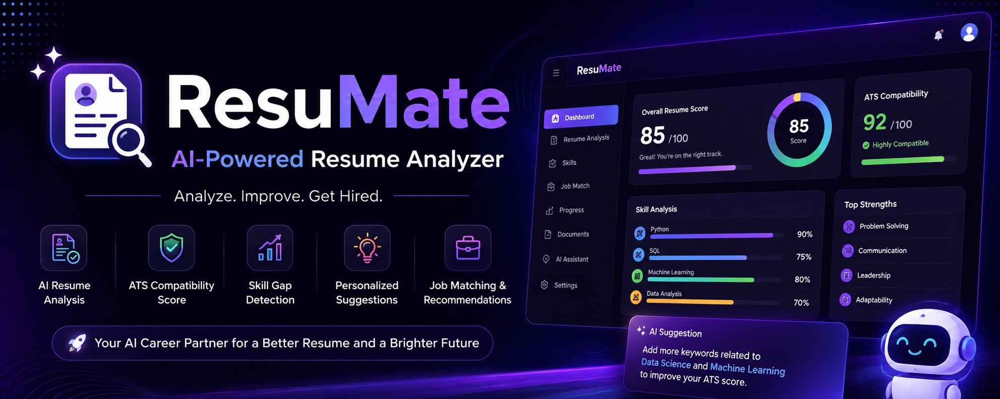

  

<h1 align="center">🤖 ResuMate AI</h1>

  <b>AI-Powered Resume Analysis & Career Recommendation Platform</b>

  
  
  
  
  

---

## 🎯 About

ResuMate AI is an AI-powered platform that analyzes resumes, evaluates ATS compatibility, identifies skill gaps, and provides personalized improvement suggestions.

It also offers job matching based on skills, experience, salary, and location preferences.

## ✨ Features

| 📄 Resume Analysis | 🎯 ATS Compatibility | 🧠 Skill Gap Detection |
|---|---|---|
| AI-powered resume evaluation | ATS scoring & optimization | Identify missing skills |

| 🔍 Keyword Analysis | 💼 Job Matching | 📍 Location Preferences |
|---|---|---|
| Find important keywords | Match suitable opportunities | Personalized location matching |

| 💰 Salary Matching | 📊 Interactive Dashboard | 🤖 AI Support Chatbot |
|---|---|---|
| Match salary expectations | Visual resume insights | Get instant assistance |

## 🛠️ Tech Stack

- HTML5
- CSS3
- JavaScript
- Python
- Flask
- SQLite

## 🚀 How It Works

1. Upload your resume
2. AI analyzes your resume
3. Get your ATS & Resume scores
4. Identify skill gaps
5. Receive improvement suggestions
6. Find suitable job matches

## 👥 Team

Developed as a collaborative project.

---

  ⭐ If you find ResuMate AI useful, consider giving it a star!

