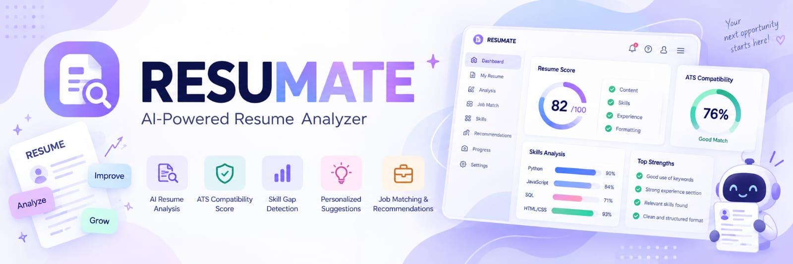

  

<h1 align="center">🤖 ResuMate AI</h1>

  <b>AI-Powered Resume Analysis & Career Assistance Platform</b>

  
  
  
  
  
  

---

## 🎯 About

**ResuMate AI** is an AI-powered resume analysis platform designed to help users understand, evaluate, and improve their resumes.

The platform extracts structured information from resumes, analyzes important sections, evaluates ATS-related factors, identifies keywords and skill gaps, and provides useful resume insights.

ResuMate also includes AI-powered chatbot support to assist users with resume-related questions and guidance.

---

## ✨ Features

<table>
<tr>
<td align="center"><b>📄 Resume Parsing</b></td>
<td align="center"><b>🧑‍💼 Information Extraction</b></td>
<td align="center"><b>🎯 ATS Analysis</b></td>
</tr>
<tr>
<td align="center">Extract data from PDF & DOCX resumes</td>
<td align="center">Extract contact, education, skills & experience</td>
<td align="center">Analyze resume ATS compatibility</td>
</tr>

<tr>
<td align="center"><b>🔑 Keyword Analysis</b></td>
<td align="center"><b>🧠 Skill Gap Detection</b></td>
<td align="center"><b>📝 Section Analysis</b></td>
</tr>
<tr>
<td align="center">Identify important resume keywords</td>
<td align="center">Detect missing and improvable skills</td>
<td align="center">Analyze key resume sections</td>
</tr>

<tr>
<td align="center"><b>🔍 Project & Experience</b></td>
<td align="center"><b>📊 Resume Insights</b></td>
<td align="center"><b>⚙️ AI-Powered Backend</b></td>
</tr>
<tr>
<td align="center">Extract projects, roles & responsibilities</td>
<td align="center">Generate structured resume insights</td>
<td align="center">Flask APIs & intelligent processing</td>
</tr>

<tr>
<td align="center"><b>🤖 AI Chatbot Support</b></td>
<td></td>
<td></td>
</tr>
<tr>
<td align="center">Get interactive resume assistance</td>
<td></td>
<td></td>
</tr>
</table>

---

## 🛠️ Tech Stack

  
  
  
  
  
  

---

## 🚀 How It Works

1. 📤 Upload your resume in PDF or DOCX format
2. 📄 ResuMate extracts and processes the resume content
3. 🧑‍💼 Important resume information is structured automatically
4. 🎯 Resume content is analyzed for ATS-related factors
5. 🔑 Important keywords are identified
6. 🧠 Potential skill gaps are detected
7. 📊 Resume insights and analysis are generated
8. 🤖 Get additional assistance through the AI chatbot

---

## 📌 Resume Sections Analyzed

ResuMate analyzes important sections of a resume, including:

- 👤 Contact Information
- 📝 Professional Summary / Objective
- 🎓 Education
- 💻 Technical Skills
- 💼 Work Experience
- 🚀 Projects
- 📜 Certifications
- 🏆 Achievements
- 🌐 Languages

---

## 📌 Project Status

🚧 **Currently in Development**

ResuMate AI is actively being developed as a collaborative project.

New features, improvements, AI capabilities, and integrations are being added progressively.

---

## 🔮 Future Scope

- 🤖 Advanced AI career recommendations
- 🎤 AI-powered interview preparation
- 🔔 Personalized job alerts
- 📈 Career growth tracking
- 🌍 Multi-language resume analysis
- 💼 Real-time job market integration
- 🔗 Job description-based resume analysis
- 📱 Mobile application

---

## 👥 Team

This project is developed collaboratively by our team.

| Member | Role |
|---|---|
| **Mansi Rawat** | Backend Developer |
| **Bhumika Bisht** | Frontend Developer |
| **Mehak Joshi** | Database Engineer |

---

  ⭐ If you find ResuMate AI useful, consider giving it a star!

